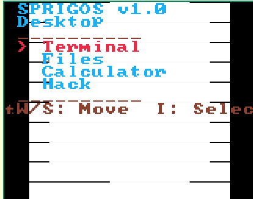
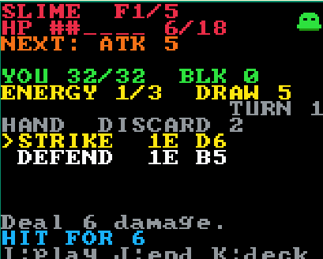
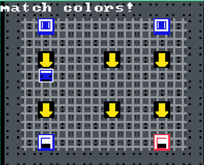
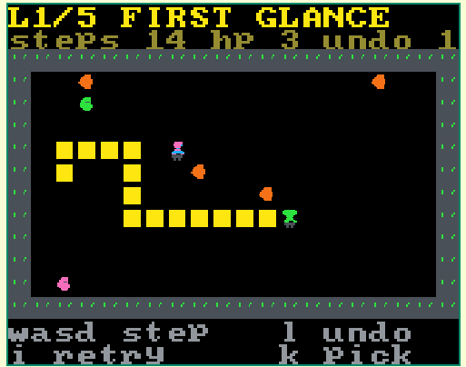
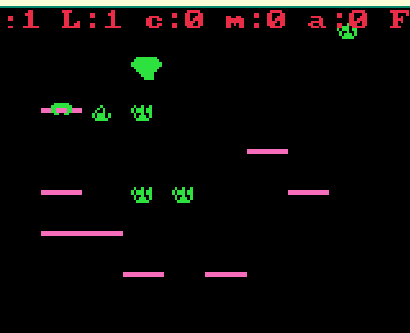
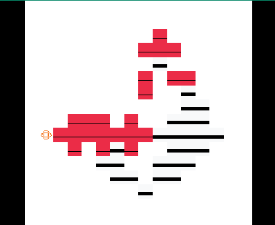
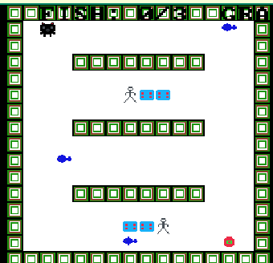

# 🎮 SPRIG GAMES COLLECTION

> **A curated gallery of original games built for the [Sprig](https://sprig.hackclub.com/) handheld console — tile-based, code-first, and ridiculously fun.**

---

## 🎯 What is This?

Bro this repo is lit! 🔥 It contains **7 complete, polished Sprig games** — each made so you can copy-paste straight into the [Sprig Editor](https://sprig.hackclub.com/editor) and play on web ya phir physical Sprig console pe.

| Game | Genre | Description | Play |
|------|-------|-------------|------|
| 🌙 **SprigOS** | OS Sim / Puzzle | A simulated operating system: desktop, terminal, file browser, calculator, and a hack-the-mainframe mini-game. | [Play ▶️](https://sprig.hackclub.com/share/ANNlTxgIrId3kEl6fydN) |
| 🃏 **Arcana Ascent** | Deckbuilding Roguelite | Climb a 5-floor tower, draft cards after each guardian, outlast the Lich. Strikes, blocks, poison, drain, heal — pure STS energy in 160×128. | [Play ▶️](https://sprig.hackclub.com/share/2nz3NPD0nm5VvfpySjln) |
| 🚂 **Rail Yard Dispatcher** | Real-Time Puzzle | Route color-coded trains to matching depots by flipping junction arrows. 3 levels, escalating speed, 3 HP, zero clones. | [Play ▶️](https://sprig.hackclub.com/share/0P2SdWjEwyQ1y0DJ7VnR) |
| 🪞 **MirrorSelf** | Mirror Puzzle | One brain, two bodies. You move; your twin mirrors you 180°. The floor remembers every tile you've touched — step on your past and you die. 5 hand-crafted levels. | [Play ▶️](https://sprig.hackclub.com/share/UTktIABTRpOXN3uuxV6V) |
| 🌱 **Shadow Harvest** | Light/Shadow Strategy | Farm crystals by growing crops in matching light phases. Place mirrors to block beasts, flash to stun them. 3 phases, dynamic crop spawns. | [Play ▶️](https://sprig.hackclub.com/share/4dvtOmgFRtMj7giObQSe) |
| 🎨 **Pixel Painter** | Generative Art Sandbox | Place colored tiles and watch them evolve via cellular automata rules. 120-second sessions, score by diversity × coverage. | [Play ▶️](https://sprig.hackclub.com/share/XH9wwilFpX9G1ofmORpU) |
| 🔦 **The Great Laser Pointer Heist** | Stealth Puzzle | Play Garfield-X the meme cat! Flip gravity, dodge flashlight patrols, grab fish energy drives, and steal the legendary red laser pointer across 7 security zones. | [Play ▶️](https://sprig.hackclub.com/share/dCbT6z5p0pomstLxg2Ft) |

---

## 🚀 Quick Start

### Play Any Game in 10 Seconds (seriously bro)

1. Open **[sprig.hackclub.com/editor](https://sprig.hackclub.com/editor)**
2. Click **New Game**
3. Copy the contents of any `.js` file below into the editor
4. Hit **RUN** ▶️

```bash
# Example: Play SprigOS
cat sprigos/game.js | pbcopy  # macOS
# or
type sprigos\game.js | clip   # Windows
# Then paste in the editor and press RUN
```

### Local Preview (Optional)

```bash
# Install deps (only needed for standalone.html preview)
npm install

# Serve the standalone SprigOS preview
npm start
# → Opens http://localhost:8080/sprigos/standalone.html
```

---

## 📁 Repository Structure

```
sprig-games/
├── index.html                   # 🌐 Landing page (gallery)
├── package.json                 # 📦 NPM config (for local preview only)
│
├── sprigos/
│   ├── game.js                  # 🌙 SprigOS — main entry (paste this)
│   └── standalone.html          # 🖥️ SprigOS standalone preview (ESM)
│
├── shadow-harvest/
│   └── shadow_harvest.js        # 🌱 Main game (paste this)
│
├── pixel-painter/
│   └── pixel-painter.js         # 🎨 Main game (paste this)
│
│
├── arcana_ascent/
│   ├── arcana_ascent.js         # 🃏 Main game (paste this)
│   ├── arcana_balance.js        # ⚖️ Card/enemy balance constants
│   ├── arcana_shot.js           # 📸 Screenshot capture script
│   ├── serve_arcana.js          # 🌐 Local dev server
│   ├── arcana_test.html         # 🧪 Browser test harness
│   └── *.png                    # 🎨 Asset previews (title, win, battle, deck, etc.)
│
├── rail-yard-dispatcher/
│   ├── rail_dispatcher.js       # 🚂 Main game (paste this)
│   ├── rail_play.html           # 🌐 Browser playable version
│   └── thumbnail.png            # 🖼️ Gallery thumbnail
│
├── mirrorself/
│   ├── mirrorself.js            # 🪞 Main game (paste this)
│   └── play.html                # 🌐 Browser playable version
│
└── laser-pointer-heist/
    └── game.js                  # 🔦 Main game (paste this)
```

> **Note:** `node_modules/` is excluded from the gallery — games run entirely in the Sprig Editor via CDN. Keep it only if you run `npm start` for the standalone preview.

---

## 🎮 Game Details & Controls

### 🌙 SprigOS (`sprigos/game.js`)



[▶️ Play on Sprig](https://sprig.hackclub.com/share/ANNlTxgIrId3kEl6fydN)

```
W/S/A/D  — Navigate desktop / menus
I        — Select / Open / Confirm
K        — Back / Cancel
L        — Restart (after win or crash)
```
**Apps:** Terminal (8 commands), Files, Calculator, Hack (5-puzzle mini-game)

---

### 🃏 Arcana Ascent (`arcana_ascent/arcana_ascent.js`)



[▶️ Play on Sprig](https://sprig.hackclub.com/share/2nz3NPD0nm5VvfpySjln)

```
W/S      — Move cursor (hand / reward / deck)
A/D      — Switch deck tabs (Deck / Draw / Discard)
I        — Play card / Confirm / Start run
J        — End turn
K        — Browse deck / Skip reward (+6 HP)
L        — Back to title
```
**Cards:** Strike, Defend, Bash, Jab, Heavy, Wall, Venom, Drain, Mend, Fire  
**Enemies:** Slime → Bat → Golem → Necro → Lich (5 floors)

---

### 🚂 Rail Yard Dispatcher (`rail-yard-dispatcher/rail_dispatcher.js`)



[▶️ Play on Sprig](https://sprig.hackclub.com/share/0P2SdWjEwyQ1y0DJ7VnR)

```
WASD     — Hop cursor between junction arrows
I / J    — Rotate arrow under cursor (↑ → → ↓ ←)
K        — Pause / Resume
L        — Restart run
```
**3 Levels:** Increasing speed, colors (Red/Blue/Yellow), walls, max trains

---

### 🪞 MirrorSelf (`mirrorself/mirrorself.js`)



[▶️ Play on Sprig](https://sprig.hackclub.com/share/UTktIABTRpOXN3uuxV6V)

```
WASD     — Step both bodies simultaneously
L        — Undo (once per level)
I        — Retry / Next level
K        — Level select / Menu
A/D      — Flip level in select screen
```
**5 Levels:** First Glance → Crossing → The Fork → Gridlock → Final Refraction

---

### 🌱 Shadow Harvest (`shadow-harvest/shadow_harvest.js`)



[▶️ Play on Sprig](https://sprig.hackclub.com/share/4dvtOmgFRtMj7giObQSe)

```
WASD     — Move farmer
I        — Harvest mature crop (stand on it)
J        — Place mirror (blocks beast path)
K        — Flash (stun all beasts, 1 use/phase)
```
**3 Phases:** Cyan → +Magenta → +Amber crystals & crops

---

### 🎨 Pixel Painter (`pixel-painter/pixel-painter.js`)



[▶️ Play on Sprig](https://sprig.hackclub.com/share/XH9wwilFpX9G1ofmORpU)

```
WASD     — Move cursor
I        — Place Red
J        — Place Blue
K        — Place Green
L        — Place Yellow
```
**120 seconds** — Tiles evolve via cellular automata (survival/reproduction rules). Score = tiles × unique colors.

---

### 🔦 The Great Laser Pointer Heist (`laser-pointer-heist/game.js`)



[▶️ Play on Sprig](https://sprig.hackclub.com/share/dCbT6z5p0pomstLxg2Ft)

```
WASD     — Move Garfield-X
J        — Flip gravity
K        — Reset level
```
**7 security zones** — Grab all fish energy drives, dodge Dr. Stick's flashlight patrols, steal the red laser pointer.

---

## 🛠️ For Contributors

### Adding a New Game
1. Create a folder: `your-game-name/`
2. Add `your-game.js` — the complete, single-file game
3. (Optional) Add `play.html` for browser testing
4. (Optional) Add `README.md` with controls & design notes
5. Update this root `README.md` with your game's entry

### Sprig Best Practices
- **Single file** — Paste-and-play in the editor
- **No external deps** — Use only Sprig APIs (`setLegend`, `setMap`, `onInput`, `afterInput`, `addText`, `playTune`, `bitmap`, `map`, `color`, `tune`)
- **Metadata header** — Include `@title`, `@author`, `@description`, `@tags`, `@addedOn` at top of `.js`
- **Test on hardware** — 160×128 screen, 6 buttons (WASD + I/J/K/L), speaker

---

## 📜 License

**MIT** — Fork, remix, and make it your own!  
Each game may have its own license header; check individual files.

---

## 🔗 Links

- **Sprig Editor:** https://sprig.hackclub.com/editor
- **Sprig Gallery:** https://sprig.hackclub.com/gallery
- **Hack Club:** https://hackclub.com/
- **Get a Sprig Console:** Submit your game to the gallery!

---

<div align="center">

**Made with 💚 for Hack Club & the Sprig Community**

*Star this repo if you love tiny games! ⭐*

</div>